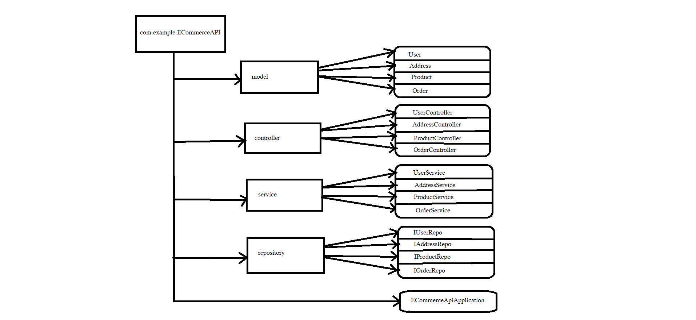

## Frameworks and language used 
* SpringBoot Framework and java language.
## Data Flow

## DataBase Design

## Data Structure used in your project
* Arraylist
## Project Summary

This is the "E_Commerce API Application" which following the mvc-Architecture.In this application, I have created a package of E-commerceApiApplication within this package I have created Four more packages to define layer as given in DFD. This project has Four Model User,Address,Product And Order which giving the relation between them.
Every User has unique address so we are performing one-to-one Mapping over here And So the User is our reference side and Address is our owning side. On the other hand, multiple Orders can order by single User,multiple Orders can be delieverd on unique Address or multiple Orders have unique Products  so that's ,we are performing many-to-one mapping on it.And storing the data in mySQL using the dependency MYSQL Driver And JPA.For posing the data, we are performing crud operations on it with the help of endpoints like @GetMapping to get all the information of the Model, @PostMapping to create a Model Information using the attributes, @deleteMapping to remove a Model related Information from list by giving specific Model Id and also providing specific Model information by giving Model Id.That's the whole project meant. 